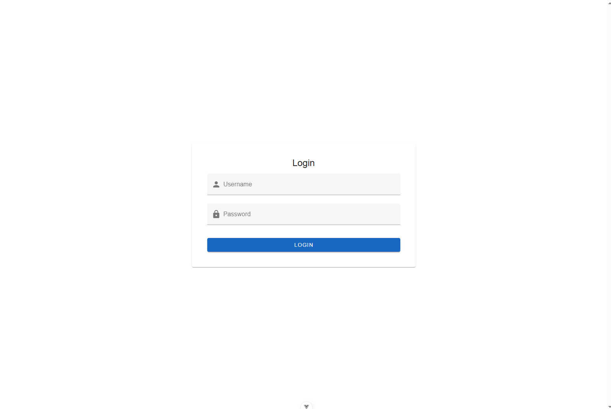
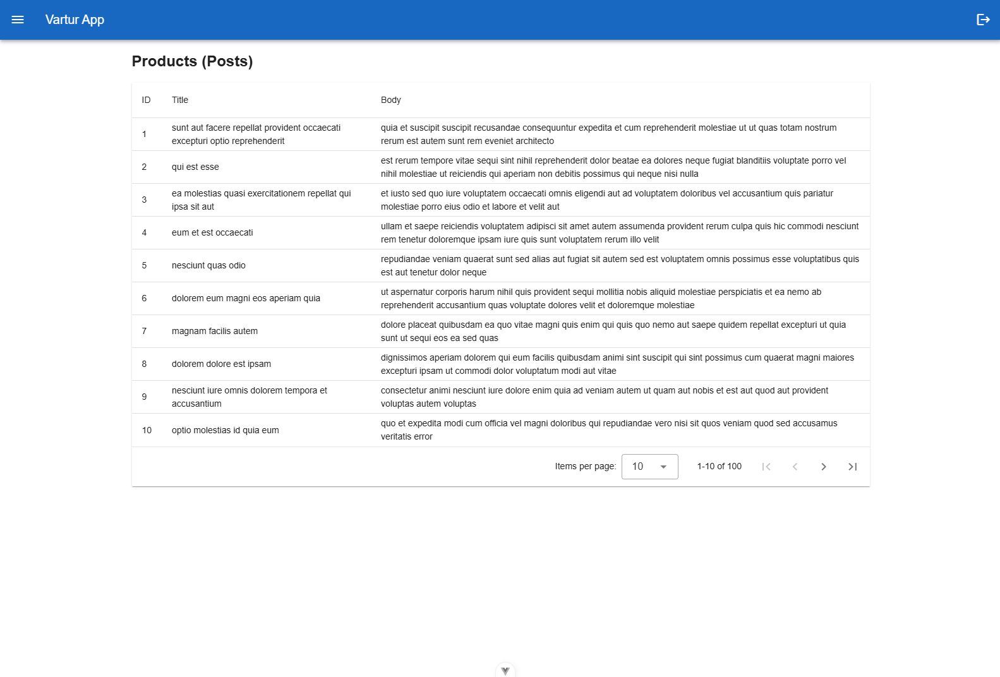
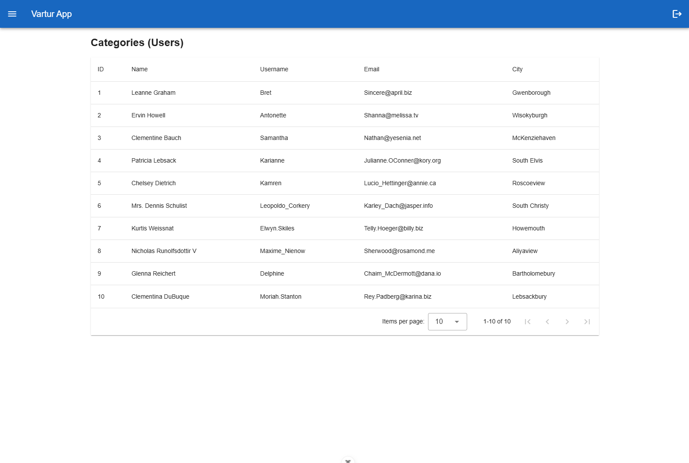

# Vartur Frontend Developer Assignment

This project is a submission for the **Senior Frontend Developer (Vue.js)** evaluation at **Vartur**.  
It demonstrates core skills in Vue 3, Vuetify, Pinia, Vue Router, and API integration.

---

## 📦 Tech Stack

- Vue 3 + Vite
- Vuetify 3 (UI components)
- Vue Router (navigation)
- Pinia (state management)
- Axios (API requests)
- Composition API

---

## 📸 Screenshots




## ✅ Features

- ✅ **Fake Authentication** using username/password: `admin / admin`
- ✅ **Protected Routes** using route guards
- ✅ **State Management** with Pinia (auth, users, posts)
- ✅ **Authentication state is managed via Pinia and persisted during the session using `sessionStorage`, ensuring protected routes are only accessible while the user is logged in.**
- ✅ **Navigation Drawer + App Bar** (Vuetify)
- ✅ **3 Pages**:
  - Home
  - Categories (Users from JSONPlaceholder)
  - Products (Posts from JSONPlaceholder)
- ✅ **Responsive Design** (Cards on mobile, Tables on desktop)
- ✅ **Composition API + Clean Folder Structure**

---

## 🖥️ Pages Preview

| Page         | Description                                    |
|--------------|------------------------------------------------|
| `/`          | Login Page (`admin / admin`)                   |
| `/home`      | Home Page with layout                          |
| `/categories`| Users list from `https://jsonplaceholder.typicode.com/users` |
| `/products`  | Posts list from `https://jsonplaceholder.typicode.com/posts` |

---

## 🚀 Run Locally

### 1. Clone the project

```bash
git clone https://github.com/YOUR_USERNAME/vartur-assignment.git
cd vartur-assignment
```

## Project Setup

```sh
npm install
```

### Compile and Hot-Reload for Development

```sh
npm run dev
```

### Compile and Minify for Production

```sh
npm run build
```